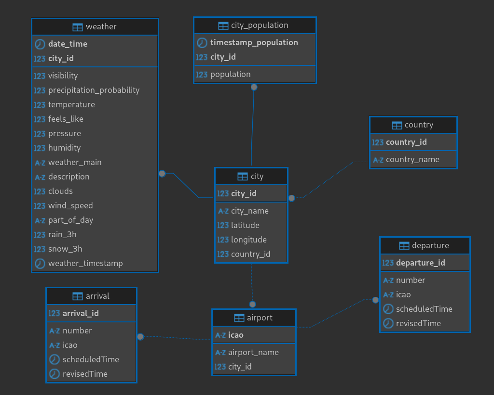

# City Data ETL Pipeline for E-Scooter Mobility Analysis

A robust ETL (Extract, Transform, Load) pipeline for collecting and analyzing city demographic data to support predictive mobility planning in e-scooter sharing systems. Developed as part of Gans' urban mobility initiative.

## Project Overview

This solution addresses critical data challenges in micro-mobility operations through automated collection of urban demographic data from Wikipedia, with architecture designed for future expansion to weather and flight data integration. The system enables:

- **Automated daily updates** of city populations
- **Geospatial tracking** through latitude/longitude coordinates
- **Historical data preservation** for trend analysis
- **Scalable infrastructure** for multi-source data integration

## Key Features

### Data Extraction Module
Implements web scraping using BeautifulSoup to retrieve:
- Current population statistics
- Geographic coordinates (latitude/longitude)
- Country/region metadata
- City classification data

### Data Transformation Engine
Utilizes pandas for:
- Data type standardization
- Missing value handling
- Coordinate format normalization
- Temporal data versioning

### Database Integration
MySQL-based storage solution featuring:
- Relational data model with city populations table
- Temporal data tracking using timestamps
- Indexed queries for fast geospatial lookups
- Schema designed for future weather/flight data

## Project Structure

├── GetCitiesInformation.ipynb # Interactive analysis notebook
├── GetCitiesInfo.py # Production-ready Python module
├── CreatingCitiesDatabase.sql # Database schema definition
└── Database_Diagram.png # Entity-Relationship diagram

## Database Architecture

## Development Roadmap

- [ ] Real-time weather data integration
- [ ] Flight API connectivity for tourism analysis
- [ ] Automated schema migration scripts
- [ ] Dockerized deployment configuration

## Contribution Guidelines

1. Fork the repository
2. Create feature branch (`git checkout -b feature/improvement`)
3. Commit changes (`git commit -am 'Add new feature'`)
4. Push to branch (`git push origin feature/improvement`)
5. Open Pull Request

## License

Distributed under MIT License. See `LICENSE` for full text.

## Acknowledgements

- BeautifulSoup contributors for web scraping tools
- MySQL and DBeaver for relational database management
- Wikipedia for geographic data references
